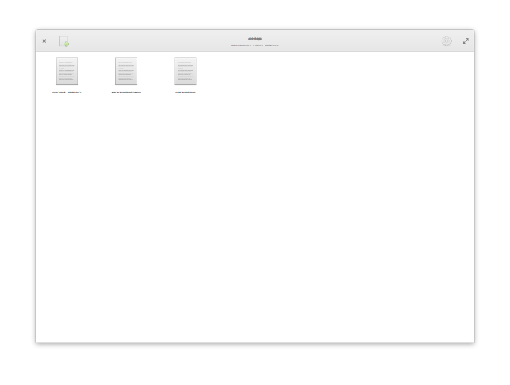

# Norka

## Preface

While I'm not the UX-man and it's just a hobby, I try to create visually appealing applications. And Norka is one of my trials to create a cozy text editor for GNOME and Elementary OS exactly. 

No markdown, no files, your data always saved and can be exported in required formats.



## Tech part

Text editor built for GNOME on top of [PyGObject](https://pygobject.readthedocs.io/en/latest/), Python 3 and GTK+ 3. Project under development so it's not production ready yet and will be massively changing in time :)


## Building

Build time requirements:

- gtk3 >= 3.20
- gtkspell3-3.0
- granite >= 5.4
- python3 >= 3.6
- python-gobject
- meson >= 0.50
- ninja
- python-sqlite

## Installing

Use meson and ninja to build and install Norka through terminal commands:

```bash
meson build
ninja -C build install
```

### AppCenter / Flathub / Snap 

Not ready yet. Will be available soon.


# Afterword

That's all. After you can run the app via command `dotnet run`.

See ya!

