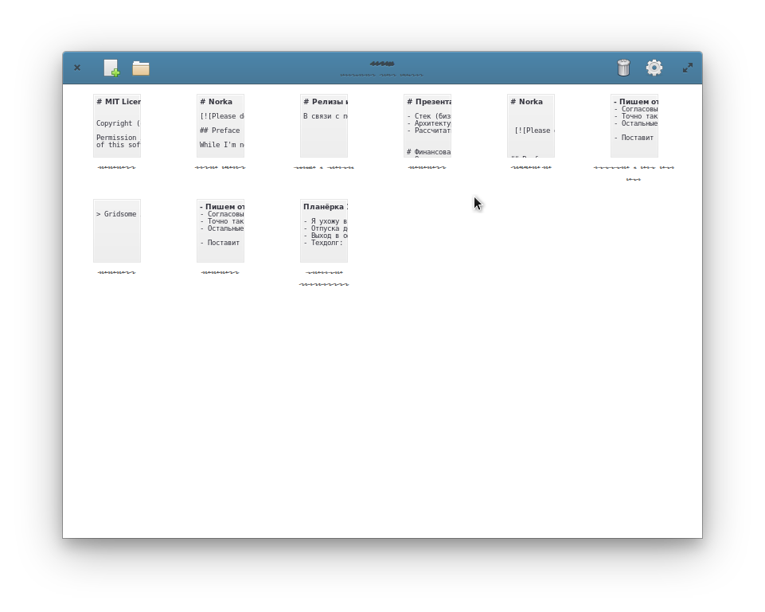

# Norka

[](https://travis-ci.com/TenderOwl/Norka)
[](https://stopthemingmy.app) 

<a href="https://flathub.org/apps/details/com.github.tenderowl.norka" class="text-center"></a>

## Preface

While I'm not the UX-man and it's just a hobby, I try to create visually appealing applications. And Norka is one of my trials to create a cozy text editor for GNOME and Elementary OS exactly. 

Markdown for markup, no files, your data always saved and can be exported in a moment.



## Tech part

Text editor built for GNOME on top of [PyGObject](https://pygobject.readthedocs.io/en/latest/), Python 3 and GTK+ 3. Project under development so it will be massively changing in time :)


## Building

Build time requirements:

- gtk3 >= 3.20
- gtkspell3-3.0
- granite >= 5.4
- python3 >= 3.6
- python-sqlite
- python-gobject
- meson >= 0.50
- ninja

## Installing

Use meson and ninja to build and install Norka through terminal commands:

```bash
meson build
ninja -C build install
```

### AppCenter / Flathub / Snap 

<a href="https://flathub.org/apps/details/com.github.tenderowl.norka" class="text-center"></a>

# Afterword

That's all. If you want to see any features or push any changes - just submit a PR or create an issue.

See ya!

