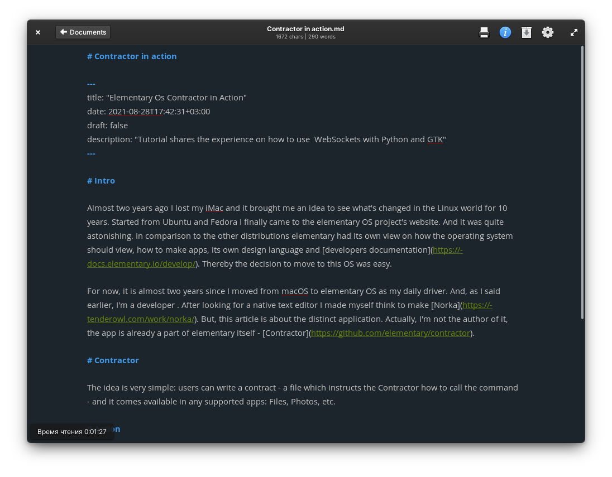

# Norka

[](https://stopthemingmy.app)
[](https://snapcraft.io/norka)
[](https://snapcraft.io/norka)

<div align="center">
  <span align="center"> </span>
  <h1 align="center">Norka</h1>
  <h3 align="center">Continuous text editing for everyone</h3>
</div>

Imagine a hassle-free text-writing experience.
Don't worry about saving files, complex markup, or accidentally deleted notes.
  
Do what you want to do - concentrate on beautiful stories, short notes, or inspired scripts. 
Norka cares about you.

<div align="center">
  
  
  <a href="https://www.buymeacoffee.com/tenderowl" target="_blank"></a>
</div>

## Features

* Markdown support
* Text search
* Autosave
* Document previews in a grid
* Reading time
* Drag-n-drop import local files
* Spell checking
* Export to files
* Export to Medium.com
* Export to Write.as
* Different color schemes for editor
* Document archiving
* And of course, you can delete them permanently

Read more on [tenderowl.com/work/norka](https://tenderowl.com/work/norka).

## Installation

<a href='https://flathub.org/apps/com.github.tenderowl.norka'></a>

## Translations

[](https://hosted.weblate.org/projects/frog/norka/)

If you feel enough power to help me - you're welcome! Just click on a widget above 😉

## :tada: Support
If you like Norka and you want to support its development it would be awesome if you help to buy me a coffee:

<a href="https://www.buymeacoffee.com/tenderowl" target="_blank"></a>


## Tech part

Text editor built for GNOME on top of [PyGObject](https://pygobject.readthedocs.io/en/latest/), Python 3 and GTK+ 3. Project under development so it will be massively changing in time :)


## Building

Build time requirements:

- meson (>= 0.49)
- python3 (>= 3.6)
- intltool
- libgranite-dev
- libgtk-3-dev (>= 3.10)
- libgspell-1-dev
- libgtksourceview-4.0-dev (>= 3.24.3)
- libwebkit2gtk-4.0
- python3-gi
- python3-gi-cairo
- gir1.2-gspell-1
- gir1.2-gtksource-3.0
- gir1.2-granite-1.0
- gir1.2-webkit2-4.0


Run meson build to configure the build environment. Change to the build directory and run `ninja` to build:

```
meson build --prefix=/usr
ninja -C build
```

To install, use `ninja install`, then execute with `com.github.tenderowl.norka`:

```
sudo ninja -C build install
com.github.tenderowl.norka
```


## Afterword

That's all. If you want to see any features or push any changes - just submit a PR or create an issue.

Brought to you by Tender Owl :owl:

